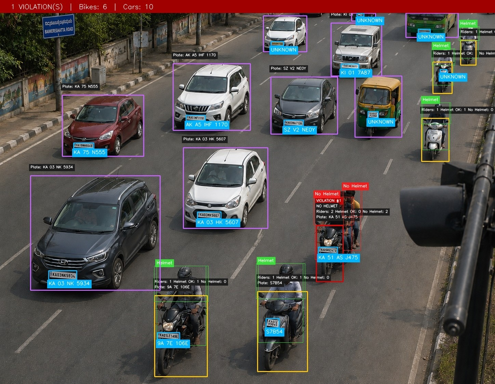

# 🚦 TrafficAI — Automated Traffic Violation Detection

> Developed by **AgentForgers**:
> **Sparsh Agrawal**, **Divy Dobariya**, **Devam Juthani**, **Shashank Pai**

[](https://react.dev/)
[](https://fastapi.tiangolo.com/)
[](#)
[](https://huggingface.co/spaces/dv000005/girdlockdeployment)
[](#)

**TrafficAI** is an AI-powered, full-stack traffic enforcement dashboard that detects, annotates, and logs traffic violations from uploaded images and video clips. It combines a React web dashboard with a parallelised computer vision inference backend deployed on HuggingFace Spaces.

---

## 📑 Project Links

| Resource | Link |
|---|---|
| 🌐 Live Dashboard (Deployment) | [https://www.orgaanix.co/](https://www.orgaanix.co/) |
| 🖥️ Frontend Repository | [Divy005/Automated_Photo_Identification_and_Classification_for_Traffic_Violations_Using_Computer_Vision](https://github.com/Divy005/Automated_Photo_Identification_and_Classification_for_Traffic_Violations_Using_Computer_Vision) |
| 🤖 Image Detection Backend | [dv000005/girdlockdeployment (HuggingFace Space)](https://huggingface.co/spaces/dv000005/girdlockdeployment) |
| 🎥 Video Detection Backend | [hiraku12/trafficlinedetector (HuggingFace Space)](https://huggingface.co/spaces/hiraku12-trafficlinedetector) |

---

## 🌟 1. High-Level Overview

TrafficAI is a two-part system:

1. **A React web dashboard** — Users upload traffic images or short video clips. The UI displays annotated evidence, a list of detected violations (including license plate numbers), vehicle counts, processing time, and session-level analytics.

2. **A FastAPI inference backend** — Runs a multi-model, two-stage parallel computer vision pipeline to detect six categories of traffic violations in real time, returning a structured JSON response with an annotated image encoded as base64.

The system is designed for real-world Indian road conditions, including licence plate OCR tuned for the Indian `LL DD LLL DDDD` format.

---

## 🎥 Media & Detections Showcase

Here is a live demonstration and example outputs from the system.

### 🎬 System Walkthrough / Video Detection Demo
<video src="https://github.com/Divy005/Automated_Photo_Identification_and_Classification_for_Traffic_Violations_Using_Computer_Vision/raw/main/public/detection-demo.mp4" width="100%" controls></video>

### 📸 Sample Detection


---

## 🧠 2. Violation Types Detected

| Violation | Detection Method |
|---|---|
| 🪖 **No Helmet** | Per-rider head crop → custom YOLOv11 helmet classifier |
| 👥 **Triple Riding** | Rider count on a detected motorcycle ≥ 3 |
| ↩️ **Wrong-Side Driving** | IoU match against custom wrong-way detection API |
| 🚗 **No Seatbelt** | Custom seatbelt detection API (per car) |
| 🅿️ **Illegal Parking** | Custom illegal parking detection API |
| 🚦 **Red-Light / Stop-Line Crossing** | Dedicated video backend with user-defined ROI line |

---

## ⚙️ 3. System Architecture

```
┌──────────────────────────────────────────────────────────────────────┐
│                    Frontend (React / TanStack Start)                 │
│                                                                      │
│  ┌──────────────┐  ┌───────────────┐  ┌────────────┐  ┌──────────┐  │
│  │    Image     │  │     Video     │  │ Analytics  │  │ Examples │  │
│  │  Inference   │  │   Inference   │  │    Tab     │  │   Tab    │  │
│  └──────┬───────┘  └───────┬───────┘  └────────────┘  └──────────┘  │
└─────────┼──────────────────┼──────────────────────────────────────────┘
          │                  │
          ▼                  ▼
┌──────────────────┐  ┌──────────────────────────┐
│  AgentForgers API│  │  Video Detection API     │
│  POST /detect    │  │  POST /api/preview       │
│  GET  /stats     │  │  POST /api/detect        │
│  GET  /violations│  │  POST /api/detect/json   │
│  GET  /health    │  └──────────────────────────┘
└──────────────────┘
```

### Backend: Two-Stage Parallel ML Pipeline

The `ParallelDetectionPipeline` (see [`pipeline.py`](https://huggingface.co/spaces/dv000005/girdlockdeployment/blob/main/pipeline.py)) orchestrates all models with a sync barrier between stages:

**Stage A — Image-Level (all tasks run in parallel):**

| Task | Model / Method |
|---|---|
| COCO Object Detection | `YOLOv8s` — detects persons, motorcycles, cars, trucks |
| Custom Two-Wheeler Detection | `stage1_best.pt` — fine-tuned YOLO for bikes |
| Depth Estimation | `Depth Anything V2` (via HuggingFace Transformers) |
| Wrong-Way Driving | Custom API |

**↕ Sync Barrier** — Merge bike boxes (COCO + custom), associate persons → bikes using depth + IoU.

**Stage B — Per-Vehicle (parallel across vehicles):**

| Task | Model / Method |
|---|---|
| Helmet Classification | `helmet_v11.pt` — crops rider's head region, classifies helmet presence |
| License Plate Detection + OCR | `license.pt` (YOLO) + `PaddleOCR (PP-OCRv5)` |

**↕ Final Barrier** — Merge all results, apply violation logic, return structured output.

---

## 🔍 4. License Plate OCR Pipeline

The plate recognition system is specifically tuned for **Indian licence plates**:

1. **Super-Resolution** — FSRCNN ×3 upscales small plate crops (< 52px height), falling back to bicubic interpolation.
2. **CLAHE** — Contrast-limited adaptive histogram equalisation on the L-channel corrects uneven lighting and shadow.
3. **Unsharp Masking** — Gaussian-based sharpening enhances character edge definition.
4. **PaddleOCR (`PP-OCRv5`)** — Mobile-optimised text detection and recognition.
5. **Position-Aware Correction** — Fixes common OCR misreads based on the Indian plate format (`LL DD L{1-3} DDDD`):
   - State code positions [0–1]: letters only (e.g. `0→O`, `1→I`)
   - District code positions [2–3]: digits only (e.g. `O→0`, `I→1`)
   - Registration number [last 4]: digits only
6. **IND Hologram Removal** — Strips `IND` / `ND` artefacts that appear between the district and series codes.

---

## 🖥️ 5. Frontend Structure

| Component | Role |
|---|---|
| [`Dashboard.tsx`](./src/components/app/Dashboard.tsx) | Root tab router: Image / Video / Analytics / Examples |
| [`ImageInference.tsx`](./src/components/app/ImageInference.tsx) | Drag-and-drop upload → calls `POST /detect` → renders `ResultPanel` |
| [`VideoInference.tsx`](./src/components/app/VideoInference.tsx) | Upload video → first-frame preview → ROI + stop-line selection → `POST /api/detect` |
| [`ResultPanel.tsx`](./src/components/app/ResultPanel.tsx) | Displays annotated image (base64), violation list, plate numbers, processing time |
| [`Analytics.tsx`](./src/components/app/Analytics.tsx) | Reads localStorage history, renders Recharts charts (violation breakdown, trends) |
| [`Examples.tsx`](./src/components/app/Examples.tsx) | Pre-loaded demo images for quick testing |
| [`api.ts`](./src/lib/api.ts) | Typed API client for both backends |
| [`history.ts`](./src/lib/history.ts) | localStorage persistence layer; aggregates detections for analytics |

### Tech Stack

| Layer | Technology |
|---|---|
| Framework | React 19 + TanStack Start (SSR) + TanStack Router |
| Build Tool | Vite 8 |
| Styling | Tailwind CSS v4 + shadcn/ui (Radix primitives) |
| Data Fetching | TanStack Query |
| Charts | Recharts |
| Deployment | Vercel (Build Output API) |

---

## 🚀 6. Getting Started

### Prerequisites
- Node.js 18+
- npm

### Installation

```bash
# Clone the repository
git clone https://github.com/Divy005/Automated_Photo_Identification_and_Classification_for_Traffic_Violations_Using_Computer_Vision.git
cd Automated_Photo_Identification_and_Classification_for_Traffic_Violations_Using_Computer_Vision

# Install dependencies
npm install

# Start the development server
npm run dev
```

The dev server runs on port `5173` by default.

### Environment Variables

Create a `.env` file in the project root to point the app at your own backends:

```bash
VITE_IMAGE_API_URL=https://your-image-api.example.com
VITE_VIDEO_API_URL=https://your-video-api.example.com
```

If unset, the app falls back to the live demo backends:
- **Image API:** `https://dv000005-girdlockdeployment.hf.space`
- **Video API:** `https://hiraku12-trafficlinedetector.hf.space`

---

## 📡 7. API Reference

### Image Detection Backend (`/detect`)

**`POST /detect`** — Upload an image, get back violations + annotated image.

```
Query params:
  return_annotated_image  bool  (default: true)  — Return base64 annotated image
  save_annotated          bool  (default: true)  — Save annotated image to disk
```

**Response:**
```json
{
  "image_id": "a1b2c3d4",
  "timestamp": "2026-06-23T16:00:00Z",
  "processing_time_ms": 1240,
  "vehicles_detected": { "bikes": 2, "cars": 1, "total": 3 },
  "violations": [
    {
      "type": "motorcycle",
      "violation_types": ["no_helmet", "triple_riding"],
      "num_riders": 3,
      "helmet_violations": 2,
      "wrong_side": false,
      "license_plate": "MH 02 AB 1234",
      "box": [120, 80, 340, 300]
    }
  ],
  "illegal_parking": [],
  "annotated_image_base64": "<base64 string>"
}
```

**`GET /health`** — Check if models are loaded.

**`GET /stats`** — Aggregate violation statistics across all stored detections.

**`GET /violations`** — Search and filter violation records.

```
Query params:
  plate           string  — Filter by plate (partial match)
  violation_type  string  — e.g. "no_helmet", "wrong_side"
  start_date      string  — ISO format
  end_date        string  — ISO format
  limit           int     — Max results (1–200, default 50)
  offset          int     — Pagination offset
```

### Video Detection Backend

**`POST /api/preview`** — Upload video, get back first-frame PNG with coordinate grid for ROI selection.

**`POST /api/detect`** — Upload video + line/ROI coordinates, get back annotated MP4 + JSON report.

**`POST /api/detect/json`** — Same as above but returns JSON only (no video output).

---

## 📊 8. Analytics & History

All detections are persisted client-side in **localStorage** (`trafficai.history.v1`), surviving navigation and page reloads. The Analytics tab aggregates this history to show:

- Total detections and violations
- Violation breakdown by type (bar chart)
- Average detection confidence
- Recent violations feed
- Detected licence plates (sorted by OCR confidence)

History is capped at 200 records. It can be cleared from the Analytics tab.

---

## 🗂️ 9. Scripts

| Script | Description |
|---|---|
| `npm run dev` | Start the Vite dev server |
| `npm run build` | Production build (Vercel output format) |
| `npm run preview` | Preview the production build locally |
| `npm run lint` | Run ESLint |
| `npm run format` | Format with Prettier |

---

## ☁️ 10. Deployment

### Vercel (Frontend)
The frontend is pre-configured for Vercel's [Build Output API v3](https://vercel.com/docs/build-output-api/v3):

1. Import the repository in Vercel.
2. Vercel reads `vercel.json` and runs `NITRO_PRESET=vercel vite build` automatically.
3. Add `VITE_IMAGE_API_URL` and `VITE_VIDEO_API_URL` in the Vercel project settings if using custom backends.

### HuggingFace Spaces (Backend)
The backend runs as a **Docker Space** on HuggingFace:
- SDK: `docker`, port `7860`
- Hardware: `cpu-basic`
- Live URL: `https://dv000005-girdlockdeployment.hf.space`

---

## 🏗️ Project Structure

```
src/
  components/
    app/        # Dashboard panels (image, video, analytics, examples)
    ui/         # shadcn/ui components (Radix primitives)
  lib/
    api.ts      # Typed inference API clients (image + video)
    history.ts  # Client-side detection history & analytics aggregator
    utils.ts    # Shared utilities
  routes/       # TanStack Router file-based routes
  router.tsx    # Router + TanStack Query client setup
  server.ts     # SSR entry with error-page fallback
  styles.css    # Global styles & Tailwind configuration
```

---

*Built for the FlipHack Final Round — Automated Photo Identification and Classification for Traffic Violations Using Computer Vision.*
